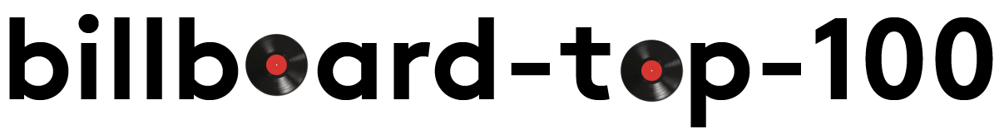

<h1 align="left">
  
  <br />
</h1>

Node.js API to retrieve top songs, albums, and artists from Billboard's charts

[](https://travis-ci.org/darthbatman/billboard-top-100)
[](https://codecov.io/gh/darthbatman/billboard-top-100)
[](https://www.codacy.com/app/darthbatman/billboard-top-100?utm_source=github.com&amp;utm_medium=referral&amp;utm_content=darthbatman/billboard-top-100&amp;utm_campaign=Badge_Grade)
[](https://github.com/darthbatman/billboard-top-100)

## install

```bash
npm install billboard-top-100
```

## example

```js
const { getChart } = require('../billboard-top-100.js');

// date format YYYY-MM-DD

getChart('hot-100', '2016-08-27', (err, chart) => {
  if (err) console.log(err);
  console.log(chart.week) // prints the week of the chart in the date format YYYY-MM-DD
  console.log(chart.previousWeek.url) // prints the URL of the previous week's chart
  console.log(chart.previousWeek.date) // prints the date of the previous week's chart in the date format YYYY-MM-DD
  console.log(chart.nextWeek.url) // prints the URL of the next week's chart
  console.log(chart.nextWeek.date) // prints the date of the next week's chart in the date format YYYY-MM-DD
  console.log(chart.songs); // prints array of top 100 songs for week of August 27, 2016
  console.log(chart.songs[3]); // prints song with rank: 4 for week of August 27, 2016
  console.log(chart.songs[0].title); // prints title of top song for week of August 27, 2016
  console.log(chart.songs[0].artist); // prints artist of top songs for week of August 27, 2016
  console.log(chart.songs[0].rank) // prints rank of top song (1) for week of August 27, 2016
  console.log(chart.songs[0].cover) // prints URL for Billboard cover image of top song for week of August 27, 2016
});

// chartName defaults to hot-100
// date defaults to saturday of this week

getChart((err, chart) => {
  if (err) console.log(err);
  // use chart
});

// date defaults to saturday of this week

getChart('hot-100', (err, chart) => {
  if (err) console.log(err);
  // use chart
});

// 'All Time' chart

getChart('greatest-billboard-200-albums', (err, chart) => {
  if (err) console.log(err);
  console.log(chart.songs); //prints array of top 200 albums
  console.log(chart.songs[3]); //prints album with rank: 4
  console.log(chart.songs[0].title); //prints title of top album
  console.log(chart.songs[0].artist); //prints artist of top songs
  console.log(chart.songs[0].rank) //prints rank of top album (1)
  console.log(chart.songs[0].cover) //prints URL for Billboard cover image of top album
});

// list all available charts

const { listCharts } = require('../billboard-top-100.js');

listCharts((err, charts) => {
  if (err) console.log(err);
  console.log(charts); // prints array of all charts
});

```

## api

### listCharts(callback)

Type: `function`

Returns array of chartObjects separated by category

### getChart(\[chartName]\[,date], callback)

Type: `function`

```chartName``` string

```date``` string ('all time' charts will not accept a date)

```callback``` function

Returns array of songs/albums/artists (as specified by chart) in chart.

### chartObject.name

Type: `string`

Name of chart.

### chartObject.url

Type: `string`

URL of chart.

### chart

Type: `object`

Chart containing songs, week, previousWeek, and nextWeek

### chart.week

Type: `string`

Chart week in date format YYYY-MM-DD

### chart.previousWeek

Type: `object`

Week object containing date and URL

### chart.nextWeek

Type: `object`

Week object containing date and URL

### chart.songs

Type: `array`

Song objects.

### weekObject.date

Type: `string`

Chart week in date format YYYY-MM-DD

### weekObject.url

Type: `string`

Chart URL

### songObject.rank

Type: `number`

Rank of song on charts.

### songObject.title

Type: `string`

Title of song.

### songObject.artist

Type: `string`

Name of artist of song.

### songObject.cover

Type: `string`

Cover image URL of song.

### songObject.position

Type: `object`

```Last Week``` string (position of song on chart last week)

```Peak Position``` string (peak position of song on chart)

```Wks on Chart``` string (number of weeks song has been on chart)

Position information of song.

## license

MIT © [Rishi Masand](https://github.com/darthbatman)
